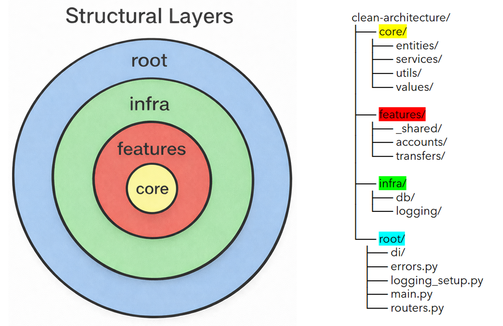
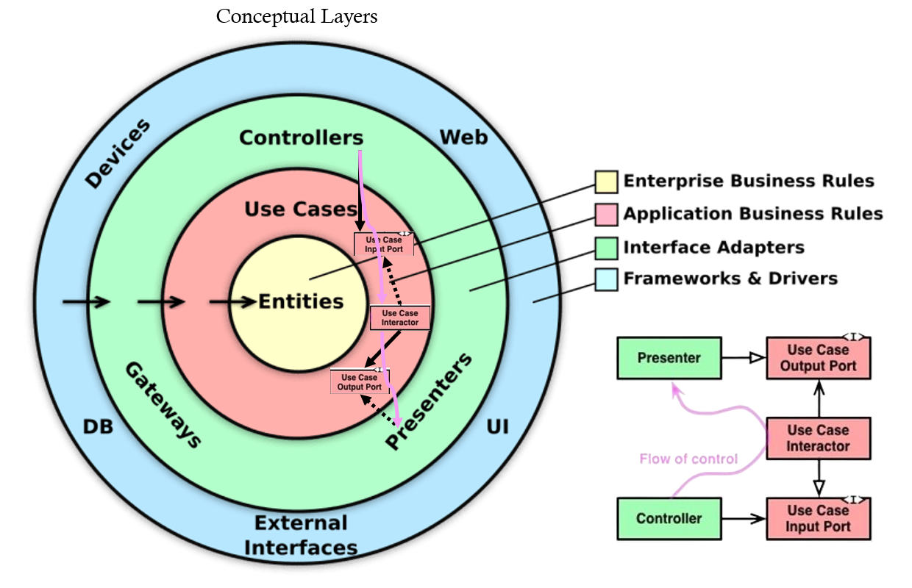

- [Clean Architecture Demo](#clean-architecture-demo)
   * [Introduction](#introduction)
   * [Repository Structure](#repository-structure)
   * [Clean Architecture Crash Course](#clean-architecture-crash-course)
      + [What Is Software Architecture?](#what-is-software-architecture)
      + [Goal of Software Architecture](#goal-of-software-architecture)
      + [The Dependency Rule](#the-dependency-rule)
      + [What Is Clean Architecture?](#what-is-clean-architecture)
      + [Conceptual Layers](#conceptual-layers)
      + [Terminology](#terminology)
         - [Repository](#repository)
         - [Controller](#controller)
         - [Use Case Input Port (Interface)](#use-case-input-port-interface)
         - [Use Case Interactor (Input Port Implementation)](#use-case-interactor-input-port-implementation)
         - [Use Case Output Port (Interface)](#use-case-output-port-interface)
         - [Presenter (Output Port Implementation)](#presenter-output-port-implementation)

# Clean Architecture Demo
## Introduction

This repository is a minimal working example demonstrating how to implement **[Clean Architecture](https://blog.cleancoder.com/uncle-bob/2012/08/13/the-clean-architecture.html)** in practice. Rather than presenting architecture only conceptually, the repository shows how to structure a real codebase so business logic remains independent from frameworks, databases, and delivery mechanisms.

The demo implements a small [FastAPI](https://fastapi.tiangolo.com/) API for a simple banking app that allows creating and retrieving accounts and making transfers between them, focusing on clarity of architectural boundaries rather than feature completeness or production readiness.

This repository demonstrates:

* How business logic is isolated from infrastructure concerns
* How use cases coordinate domain behaviour
* How controllers, presenters, and repositories interact through ports
* How dependency direction is preserved across layers
* How business logic can be tested independently of frameworks or databases

It serves both as a learning resource and as a practical reference when structuring new projects using Clean Architecture.

## Repository Structure

> [!NOTE]
> If you're unfamiliar with Clean Architecture, see the crash course in the sections below.

This repository follows the same inward-dependency idea as Clean Architecture, but organises layers slightly differently for practical development.

* **core/** – The innermost layer containing domain entities, value objects, and core business rules. This layer is completely independent and must not depend on any outer layer.

* **features/** – Organises application logic into isolated features. Each feature contains its own use cases and adapters. Features do not import from one another directly; shared contracts or ports live in `features/_shared` when cross-feature communication is necessary.

* **infra/** – Infrastructure and framework implementations such as database access and logging. This corresponds to the frameworks and drivers layer in Clean Architecture.

* **root/** – Application entry point and wiring layer. It initialises frameworks (e.g., FastAPI), configures routing, dependency injection, and connects infrastructure implementations to application ports.

While structural layers differ from conceptual ones to allow for feature isolation and other benefits, the Dependency rule still holds: inner layers do not know about outer layers, and dependencies always point inward.

## Clean Architecture Crash Course

### What Is Software Architecture?

Software architecture is the fundamental blueprint of a software system, defining its core structures, components, relationships, and behaviours to meet technical and business needs.

Architecture answers questions such as:

* Where does business meaning live?
* What can change without forcing everything else to change?
* What is allowed to know about the database?
* What is allowed to know about HTTP?

---

### Goal of Software Architecture

The main goal of software architecture is:

> to minimise the human resources required to build and maintain the required system.

Good architecture reduces long-term cost and complexity rather than merely making the system work today.

Some characteristics of a good architecture are:

* **Testable** – Core behaviour is easy to verify with fast, isolated tests.
* **Scalable** – Complexity grows roughly linearly as features and teams grow.
* **Detail-agnostic** – Frameworks, databases, or UIs can change without rewriting business logic.
* **Cohesive** – Related rules live together; each module has a clear purpose.
* **Loosely coupled** – Changes remain local rather than rippling across the system.
* **Readable** – The system’s boundaries and responsibilities are obvious, even if individual flows are indirect.

---

### The Dependency Rule

Source code dependencies must always point inwards: higher-level policy must not depend on lower-level technical details.

This rule ensures that business logic remains independent from infrastructure concerns and that technical choices do not dictate core system behaviour.

Implications:

* Technical code may depend on core logic, never the reverse.
* Changing frameworks or databases must not affect business behaviour.
* Meaning comes before mechanism.
* Policy is stable, implementation is disposable.
* Execution flow may go outwards, dependencies must not (runtime calls can go from policy to infrastructure even if imports do not).
* Interfaces define what is needed, implementations define how it is done.

---

### What Is Clean Architecture?

Clean Architecture is a systematic approach to implementing and enforcing the dependency rule.

It structures systems so that business rules remain stable while infrastructure and delivery mechanisms can change freely, keeping core logic protected from external changes.

---

### Conceptual Layers

Clean Architecture separates systems into conceptual layers:

* **Entities / Domain** – Core business objects and rules that represent the problem space itself. These models and invariants should remain stable even if databases, frameworks, or interfaces change.

* **Use Cases / Application Layer** – Application-specific business logic that orchestrates domain entities to achieve user goals. This layer defines how the system behaves in response to actions, without depending on delivery or infrastructure details.

* **Interface Adapters** – Components that translate between the outside world and the application layer, such as controllers, presenters, and repositories. They convert external formats (HTTP, DB rows, UI models) into forms the use cases understand and vice versa.

* **Infrastructure / Frameworks** – Technical details such as databases, web frameworks, UI frameworks, and external services. These are implementation mechanisms that support the application but should not influence core business logic.

Dependencies always point inward toward business logic.

---

### Terminology

The following sections describe the components used in this demo and their roles within Clean Architecture.

#### Repository

An infrastructural component that hides database details and lets use cases Create, Read, Update, and Delete domain entities through a simple interface.

##### Why do we need it?

* Keeps business logic independent from database and storage details
* Makes the system easier to test (no real database needed)
* Allows changing persistence technology without touching use cases
* Centralises data access logic in one place

##### What happens if we remove it?

* Database queries end up inside use cases
* Every use case must handle persistence logic itself (bad for use-case isolation)
* Changing the database forces changes across many use cases
* Tests must use a real database or heavy setup

---

#### Controller

Controls how external requests enter and leave the system by translating requests into use case input, delegating execution and response formatting, and returning the result.*

##### Why do we need it?

* Endpoint code stays small and easy to modify without risking business logic
* Changing request/response formats doesn’t require touching use case code
* Different delivery mechanisms (HTTP, CLI, jobs, etc.) can have their own controllers without changing use cases
* HTTP concerns and business rules don’t get mixed in the same files

##### What happens if we remove it?

* Small API changes risk breaking business logic
* Use cases must understand HTTP requests and responses
* Reusing logic outside HTTP requires rewriting parts of it
* Endpoint files grow large and harder to maintain

\**Context-specific definition for clarity; simplified from the theoretical definition.*

---

#### Use Case Input Port (Interface)

An interface owned by the use case that defines how the use case can be invoked and what input it requires, without exposing its internal implementation.

##### Why do we need it?

* The use case controls how it can be called instead of external layers deciding it
* Controllers depend on the use case contract, so the use case implementation can be swapped/refactored without touching controllers
* A hard boundary that stops controllers drifting into implementation-specific things
* The same use case can be safely invoked from multiple controllers or drivers through a single contract

##### What happens if we remove it?

* Controllers depend directly on concrete use case implementations
* Changes inside the use case may leak outward and force changes in controllers
* The use case may lose control over its boundary and become shaped by delivery-layer needs

---

#### Use Case Interactor (Input Port Implementation)

The component that contains the application’s business logic and executes the use case by coordinating entities, domain services, and external services (repositories, other features, etc.)

##### Why do we need it?

* Business rules live in one place instead of being spread across controllers or infrastructure code
* Logic can be tested without HTTP, databases, or UI involved
* Business logic remains independent from frameworks and delivery mechanisms, allowing reuse in different contexts

##### What happens if we remove it?

* Business logic spreads into controllers or infrastructure code
* Changing behaviour requires touching many unrelated parts of the system
* Testing requires running large parts of the system instead of isolated logic
* The system becomes harder to understand and maintain as responsibilities mix together

---

#### Use Case Output Port (Interface)

An interface owned by the use case that defines how results leave the use case and is implemented by the outward layer (presenters).

##### Why do we need it?

* Preserves correct dependency direction by keeping ownership in the use case
* The use case returns results without knowing who or what will present them
* Different presenters can handle results in different ways using the same use case
* Prevents presentation concerns from leaking into the use case

##### What happens if we remove it?

* Use cases must depend directly on concrete presenters or response formats, breaking the Dependency rule
* Changing how results are presented forces changes inside business logic
* Business logic becomes coupled to delivery or UI layers

---

#### Presenter (Output Port Implementation)

Converts use case results into a response format required by a specific interface (HTTP API, UI, CLI, etc.)

##### Why do we need it?

* Implements the output port so use cases stay independent from delivery layers
* Converts use case results into interface-specific responses
* Allows the same use case result to be presented differently in different interfaces
* Presentation changes don’t require modifying use cases

##### What happens if we remove it?

* Controllers or use cases start formatting responses themselves
* More difficult to reuse the same use case output in different interfaces
* Presentation logic might spread across multiple places
